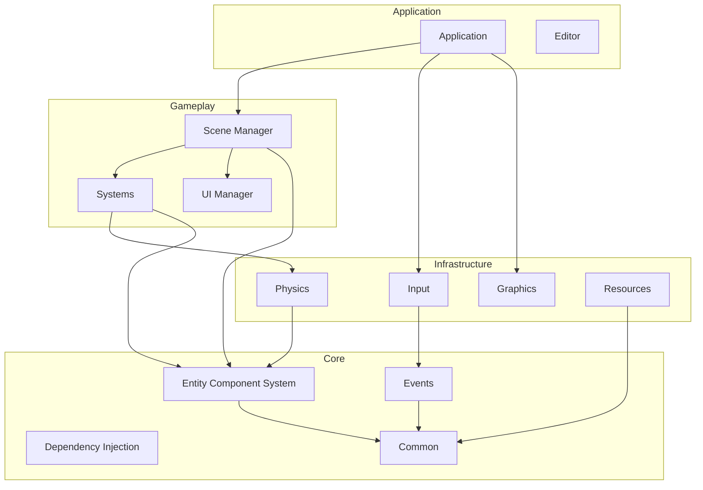

# PyGuara Dependency Map & Architectural Analysis

**Last Updated:** January 11, 2026
**Scope:** Full Codebase Analysis

This document serves as a reference for the engine's static structure, module interdependencies, and architectural layers. It is intended to guide refactoring efforts and help new contributors understand the "physics" of the codebase.

## 1. Architectural Layers

The engine adheres to a strict stratified architecture. Dependencies should generally flow downwards (higher layers depend on lower layers).

| Layer | Level | Responsibilities | Key Modules |
| :--- | :--- | :--- | :--- |
| **Application** | 4 | Orchestration, Composition Root, Tooling | `application`, `editor`, `main.py` |
| **Gameplay** | 3 | High-Level Logic, AI, UI, State | `scene`, `ui`, `ai`, `animation`, `systems` |
| **Infrastructure** | 2 | Hardware Abstraction, Resources, Simulation | `graphics`, `audio`, `input`, `physics`, `resources`, `config` |
| **Foundation** | 1 | Core Patterns, Data Structures, Errors | `ecs`, `di`, `events`, `common`, `error` |

### Violation Check
- **Strict Rule:** Foundation modules must **never** import from Gameplay or Application.
- **Strict Rule:** Infrastructure should access Foundation but avoid Gameplay dependencies.

## 2. Subsystem Dependency Breakdown

### 2.1 Foundation Layer (Tier 1)
These modules are the bedrock of the engine.

*   **`pyguara.common`**: Zero dependencies. Holds shared types (`Vector2`, `Color`) and constants.
*   **`pyguara.error`**: Zero dependencies. Custom exception hierarchy.
*   **`pyguara.di`**: Zero dependencies. The IOC container.
*   **`pyguara.events`**: Depends on `common` (protocols). The backbone of decoupled communication.
*   **`pyguara.ecs`**:
    *   **Core**: Depends on `common`.
    *   **Internal Circularity**: `manager.py` ↔ `query_cache.py`.
        *   *Analysis:* `EntityManager` uses `QueryCache` for optimization. `QueryCache` types `EntityManager` for hints.
        *   *Resolution:* Runtime dependency is One-Way (Manager -> Cache). Circular type hint handled via `TYPE_CHECKING`.
    *   *Note:* This module is "pure logic" and doesn't know about physics or graphics.

### 2.2 Infrastructure Layer (Tier 2)
Bridges the abstract Core to concrete implementations (Hardware/OS).

*   **`pyguara.resources`**:
    *   Depends on: `common`, `error`.
    *   Role: Loads assets from disk.
*   **`pyguara.input`**:
    *   Depends on: `events`, `common`.
    *   Role: Polling hardware and dispatching `InputEvent`s.
*   **`pyguara.physics`**:
    *   Depends on: `ecs` (components), `common` (transforms), `events` (collisions).
    *   *Design Pattern:* **Bridge**. `PhysicsSystem` syncs internal ECS `Transform` with external `Pymunk` bodies.
*   **`pyguara.graphics`**:
    *   Depends on: `common` (primitives).
    *   *Design Pattern:* **Protocol-based Backend**. `IRenderer` defines the contract; `PygameRenderer` implements it.

### 2.3 Gameplay Layer (Tier 3)
Where the "Game" actually happens.

*   **`pyguara.scene`**:
    *   Depends on: `ecs`, `di`, `ui`, `graphics` (protocols).
    *   Role: Composition Root for specific game states.
*   **`pyguara.ui`**:
    *   Depends on: `events`, `common`, `graphics` (protocols).
    *   Role: Managing widget hierarchy and input routing.
*   **`pyguara.systems`**:
    *   Depends on: `ecs`, `physics`, `graphics`, `ai`.
    *   Role: The "Systems" in ECS.
    *   **Architectural Hotspot**: See Section 3.1.

### 2.4 Application Layer (Tier 4)
*   **`pyguara.application`**:
    *   Depends on: **Everything**.
    *   Role: The `Application` class orchestrates the Main Loop:
        1.  Clock/Delta Time
        2.  `InputManager.process_input()`
        3.  `EventDispatcher.process_queue()`
        4.  `SceneManager.update()`
        5.  `SceneManager.render()`

## 3. Architectural Insights & Hotspots

### 3.1 The "Push" vs "Pull" System Conflict
A critical divergence exists in how Systems interact with the ECS.

*   **Type A: Pure Systems (Push)**
    *   *Example:* `PhysicsSystem.update(entities: List[Entity], dt: float)`
    *   *Behavior:* Caller (Scene) must query `EntityManager`, filtering entities, and pass them to the system.
    *   *Pros:* System is purely functional/stateless regarding data retrieval. High testability.
    *   *Cons:* Leaks logic into the Scene. Incompatible with generic `SystemManager`.
*   **Type B: Self-Sufficient Systems (Pull)**
    *   *Example:* `AISystem(manager: EntityManager)`
    *   *Behavior:* System holds a reference to `EntityManager` and queries what it needs internally.
    *   *Pros:* Encapsulation. Plug-and-play with `SystemManager`.
    *   *Cons:* Tighter coupling to ECS implementation.

**Decision:** The engine is standardizing on **Type B (Pull)** via Dependency Injection (Ref: Backlog P2-013).

### 3.2 Dependency Injection Flow
*   **Bootstrap (`bootstrap.py`)**: The single source of truth.
*   **Resolution Strategy**:
    *   Core systems (`EventDispatcher`, `ResourceManager`) -> **Singleton**.
    *   Game Logic (`PhysicsSystem`, `RenderSystem`) -> **Scoped** (Scene-level) or **Transient**.
*   **Wiring**:
    *   Classes declare dependencies in `__init__`.
    *   Container uses `inspect` to resolve them.
    *   *Note:* Avoid `container.get()` inside loops. Resolve once during initialization.

### 3.3 Event Propagation Graph
*   **Input** -> `InputManager` -> `EventDispatcher` -> **Subscribers** (UI, PlayerController).
*   **Physics** -> `CollisionCallback` -> `EventDispatcher` -> **Subscribers** (Audio, Gameplay).
*   **State** -> `SceneManager` -> `EventDispatcher` -> **Subscribers** (Analytics, LoadingScreen).

## 4. Graph Visualization (Mermaid)

